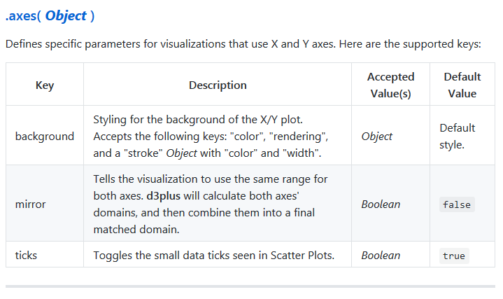

```{r setup, include=FALSE}
knitr::opts_chunk$set(echo = TRUE)
```

## Roteiro

- Introdução

- Instalação

- Conhecendo o D3plus

- Exemplos de visualizações com o D3plusR

- Números

- Atributos

# Introdução {data-background=#000000}

## Sobre o D3plusR

- Utiliza a biblioteca JavaScript D3plus 

- D3plus é construída em cima da biblioteca D3

- Gráficos simples e de fácil criação

- Htmlwidgets + D3plus = D3plusR

- Visualizações dinâmicas para documentos (RMarkdown) e aplicações (Shiny)

- Material auxiliar disponível [aqui](http://fulljoin.com.br/tutorial_d3plusr/)

# Instalação {data-background=#000000}

## Instalando o D3plusR

- O pacote está em desenvolvimento

- Disponível apenas no github:

```{r, eval=FALSE}
devtools::install_github('paulofelipe/D3plusR')
```

# Conhecendo o D3plus {data-background=#000000}

## Por que é importante conhecer o D3plus?

- Pacotes criados htmlwidgets são apenas interfaces para a biblioteca JavaScript

- Conhecer a potencialidade da biblioteca original

- Conhecer a documentação e opções

## Projetos que usam D3plus

- [Observatory of Economic Complexity](http://atlas.media.mit.edu/en/)

- [Data USA](https://datausa.io/)

- [DataViva](http://dataviva.info/pt/)

- [Comex Vis](http://www.mdic.gov.br/comercio-exterior/estatisticas-de-comercio-exterior/comex-vis)

## Exemplo de código

- D3plus

```js
  var visualization = d3plus.viz()
    .container("#viz")
    .data(data)
    .type("bar")
    .id("name")
    .x("year")
    .y("value")
    .draw()
```

- Transcrevendo para D3plusR

```{r, eval=FALSE}
d3plus(data = data, type = "bar", 
       id = "name") %>% 
  d3plusX("year") %>% 
  d3plusY("value")
```

## Exemplo de código (Cont.)

* Métodos: `.type()`, `.id()`, `.x()` etc.

* Métodos mais usados já são argumentos da função `d3plus()` (`data`, `type` e `id`)

> Obs: existe a função `d3plusId()` para configuração de outras opções do id. Possivelmente, todas terão sua função própria.

* Demais: `d3plusX()`, `d3plusY()`, `d3plusTitle()` ...

## Estrutura de dados javascript

- Qual é o problema?
```{r, eval=FALSE}
.axes({"ticks": false,
       "background": {"color": "#FFFFFF",
                      "stroke": {"width": 0}}})
```

- Em D3plusR:
```{r,eval=FALSE}
d3plusAxes(ticks = FALSE,
           background = list(color = "#FFFFFF",
                             stroke = list(width = 0)))
```

- Opções de opções devem ser passsadas em listas

## Exemplo de documentação




# Exemplos de visualizações com o D3plusR {data-background=#000000}

## Primeira Visualização

- Utilizar `Parte1.Rmd`

```{r, message=FALSE, warning=FALSE, eval = FALSE}
library(D3plusR)
library(dplyr)

dados <- data.frame(X = c("a", "b"), Y = c(2, 3),
                    id = c("id1", "id1"))

d3plus(data = dados, type = "bar", id = "id") %>% 
  d3plusX("X") %>% 
  d3plusY("Y")
```

